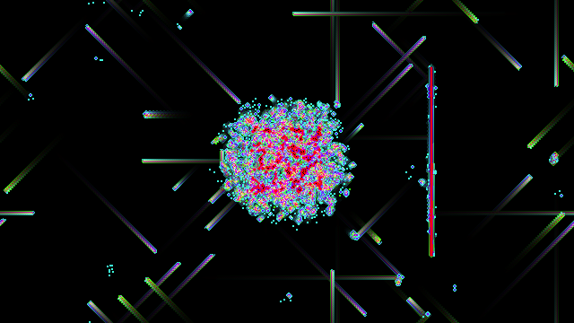

Frequency-Based colorization of binary cellular automata
=======

Assign colors to the cellular automata cells according to their flashing frequency.

Plus, some useless scripts.

Implementation: Python2 + ctypes, C++



Scripts
-------

* **make_color_animation.py** creates sequence of color frames. Parameters are set up in the source. 
* **singlerot_spectrum.py**, **singlerot_spectrum_plot.py**
  An experiment with calculating averaged spectrum of oscillations of the cells in the "Single Rotation" rule.
* **rca_pygame**: Displays animated reversible cellular automaton using Pygame. Not very useful, online simulator recommended: http://dmishin.github.io/js-revca/index.html


Compiling
---------

For better performance, critical parts of the code are written in C++ and used via ctypes. To compile C++ modules, run:

```sh
make
```

On Windows, run:
```
make.cmd
```
This build script written for the mingw compiler. Change it apropriately to use different compiler.

Installation
------------
Not provided.

Requrements
-----------

* g++: compile C++ modules
* python2.x
* Numpy

Lincense
--------
MIT.